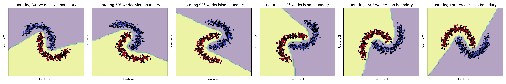

# A Generative and Self-Training Framework for Temporal Domain Generalization Without Intermediate Supervision

- This project explores generative artificial intelligence techniques focusing on Temporal Domain Generalization with Drift-Aware Dynamic Neural Networks (DRAIN).
The goal is to understand and visualize how generative models progressively modify or synthesize image content through structured flows.

- This repository is a sandbox for coursework projects focused on rapid prototyping and educational demos.


## Overview

This method models the temporal evolution of data distributions using a recurrent VAE-based framework. At each domain step 𝑡, a recurrent model (LSTM) generates VAE parameters 𝜔, which are used to reconstruct input data via a domain-specific decoder.
- Reconstruction-based data generation: For each domain, reconstructed data is produced using the generated VAE.
- Self-training with pseudo-labels: A classifier is trained using source labels first, then adapted to later domains using pseudo-labels generated from previous classifiers.


## Setup
1. Create a Conda environment
```bash
conda create -n generative_demo python=3.10
```

2. Activate the environment
conda activate generative_demo
```bash
pip install -r requirements.txt
```

## Usage
1. Train the VAE mode
```bash
python train_vae.py --dataset Moons
```
2. Train the classifier
```bash
python train_classifier.py --dataset Moons
```
3. Visualize the results
```bash
python vvs_moons.py
```
4. Check generated visualizations
```bash
ls ./visual
```

## Experiment
- Evolving decision boundary in two moons dataset trained by our method


- Evolving decision boundary in shuttle dataset trained by our method

